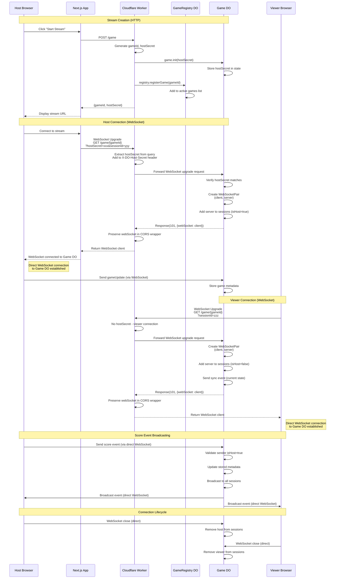

# Live Stream Feature

The Darts Scorer application supports live streaming of games, allowing unlimited viewers to watch games in real-time.

## Overview

The live stream feature uses Cloudflare Durable Objects to provide:
- Real-time score updates
- Automatic state synchronization for late joiners
- Type-safe communication between host and viewers
- Scalable architecture supporting unlimited viewers

## Architecture

### Components

1. **Cloudflare Worker** (`workers/darts-live-stream/`)
   - Handles WebSocket connections
   - Routes requests between hosts and viewers
   - Manages game state persistence

2. **Game Durable Object**
   - Stores game metadata and current state
   - Verifies host authentication
   - Broadcasts events to all connected viewers
   - Manages WebSocket sessions

3. **GameRegistry Durable Object**
   - Tracks active games
   - Provides game discovery (future feature)
   - Provides cleanup method for old game entries (requires periodic invocation)

4. **Frontend Integration**
   - Host controls: Start/stop stream, share URL
   - Viewer page: Real-time score display
   - Automatic reconnection on connection loss

## Technical Details

### WebSocket Connection Setup

The live stream feature uses WebSocket connections for real-time bidirectional communication between hosts/viewers and the Cloudflare Worker.

#### Connection Flow



**Key Points:**
- **The Worker facilitates the WebSocket upgrade**: The Worker receives the initial WebSocket upgrade request, extracts authentication parameters, and forwards the request to the appropriate Game DO
- **Game DO creates direct WebSocket connections**: The Game DO creates a WebSocketPair and returns one end to the client through the Worker. After the upgrade, clients have a **direct WebSocket connection to the Game DO**
- **Messages flow directly between clients and Game DO**: Once the WebSocket is established, all messages (score events, broadcasts, etc.) flow directly between the client and the Game DO without going through the Worker
- **The Worker's role is limited to the initial handshake**: After returning the WebSocket upgrade response, the Worker is no longer involved in the WebSocket communication

This architecture provides optimal performance since messages don't need to be proxied through the Worker.

#### Host Authentication Flow

Due to browser WebSocket API limitations (no custom headers support), host authentication uses a hybrid approach:

1. **Query Parameter for WebSocket**: The `hostSecret` is sent as a query parameter in the WebSocket URL
   - Example: `ws://worker/game/abc123?hostSecret=xyz789`
   - This is secure for WebSockets as `ws://` URLs are not logged in browser history
   - The secret only appears in the WebSocket upgrade request

2. **Header Conversion at Worker**: The worker immediately extracts the secret from the query string and converts it to a header
   ```typescript
   const hostSecret = url.searchParams.get('hostSecret') || 
                     request.headers.get('X-DO-Host-Secret');
   ```

3. **Durable Object Validation**: The Game DO receives the secret via header and validates it
   ```typescript
   const providedSecret = request.headers.get('X-DO-Host-Secret');
   const isHost = providedSecret === this.state.hostSecret;
   ```

This approach ensures:
- ✅ Browser compatibility (query params work with WebSocket API)
- ✅ Security (secret not logged in browser history, immediately converted to header)
- ✅ Server-side validation (DO never sees query param, only header)
- ✅ Backward compatibility (HTTP endpoints still use headers only)

#### Connection State Management

The `LiveStreamManager` tracks connection state through a state machine:

```
disconnected --> connecting --> connected
     ^              |               |
     |              v               v
     +-------- reconnecting <-------+
                   |
                   v
            disconnecting --> disconnected
```


## Limitations

- Games are stored for 24 hours after creation
- Maximum game duration: No limit (as long as connection is active)
- Viewer capacity: No hard limit (Cloudflare Durable Objects scale automatically)


## Possible Future Enhancements

- Game Discovery/Browsing
- Game history for completed streams
- Viewer chat/reactions
- Analytics and statistics
- Custom branding for streams
