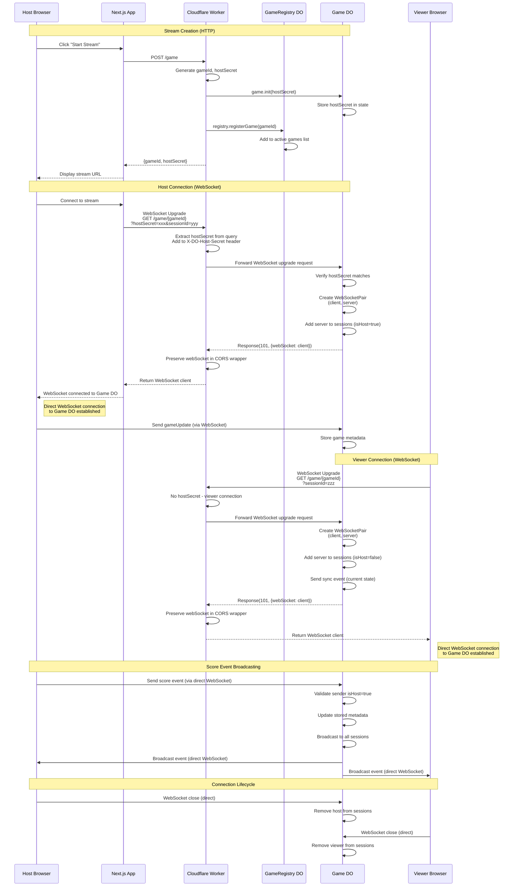

# Live Stream Feature

The Darts Scorer application supports live streaming of games, allowing unlimited viewers to watch games in real-time.

## Overview

The live stream feature uses Cloudflare Durable Objects to provide:
- Real-time score updates
- Automatic state synchronization for late joiners
- Type-safe communication between host and viewers
- Scalable architecture supporting unlimited viewers

## Architecture

### Components

1. **Cloudflare Worker** (`workers/darts-live-stream/`)
   - Handles WebSocket connections
   - Routes requests between hosts and viewers
   - Manages game state persistence

2. **Game Durable Object**
   - Stores game metadata and current state
   - Verifies host authentication
   - Broadcasts events to all connected viewers
   - Manages WebSocket sessions

3. **GameRegistry Durable Object**
   - Tracks active games
   - Provides game discovery (future feature)
   - Provides cleanup method for old game entries (requires periodic invocation)

4. **Frontend Integration**
   - Host controls: Start/stop stream, share URL
   - Viewer page: Real-time score display
   - Automatic reconnection on connection loss

## Usage

### For Hosts

1. **Start a Live Stream**:
   - Set up your game as usual
   - Before starting the game, enable the "Live Stream" option
   - Click "Start Stream"
   - Copy the shareable URL

2. **Share with Viewers**:
   - Send the generated URL to viewers via any communication channel
   - The URL format is: `https://your-domain.com/?live-stream=<game-id>`

3. **During the Game**:
   - Play normally - all score events are automatically broadcast
   - The live indicator shows connection status
   - Viewers will see updates in real-time

4. **Stop Streaming**:
   - Click "Stop Stream" to end the broadcast
   - Viewers will be disconnected

### For Viewers

1. **Join a Stream**:
   - Open the shared URL in your browser
   - Wait for the connection to establish

2. **Watch the Game**:
   - See real-time score updates
   - View player statistics
   - See who's currently throwing
   - Watch game progress (rounds, winners)

3. **Late Joining**:
   - Join at any time during the game
   - Automatically receive current game state
   - See all subsequent updates in real-time

## Setup

### Development

1. **Configure Environment Variables**:
   ```bash
   cp .env.example .env
   # Edit .env and set NEXT_PUBLIC_LIVE_STREAM_WORKER_URL
   ```

2. **Start the Worker** (in a separate terminal):
   ```bash
   cd workers/darts-live-stream
   pnpm dev
   # Worker will run on http://localhost:8787
   ```

3. **Start the Next.js App**:
   ```bash
   pnpm dev
   # App will run on http://localhost:3000
   ```

4. **Test the Feature**:
   - Navigate to http://localhost:3000
   - Set up a game
   - Enable live stream
   - Open the viewer URL in another browser tab

### Production

1. **Deploy the Worker**:
   ```bash
   cd workers/darts-live-stream
   pnpm deploy
   # Note the deployed worker URL
   ```

2. **Configure the Frontend**:
   ```bash
   # Set environment variable in your hosting platform
   NEXT_PUBLIC_LIVE_STREAM_WORKER_URL=https://your-worker.workers.dev
   ```

3. **Deploy the Frontend**:
   - Deploy to Vercel, Netlify, or your preferred platform
   - Ensure the environment variable is set

## Technical Details

### WebSocket Connection Setup

The live stream feature uses WebSocket connections for real-time bidirectional communication between hosts/viewers and the Cloudflare Worker.

#### Connection Flow



**Key Points:**
- **The Worker facilitates the WebSocket upgrade**: The Worker receives the initial WebSocket upgrade request, extracts authentication parameters, and forwards the request to the appropriate Game DO
- **Game DO creates direct WebSocket connections**: The Game DO creates a WebSocketPair and returns one end to the client through the Worker. After the upgrade, clients have a **direct WebSocket connection to the Game DO**
- **Messages flow directly between clients and Game DO**: Once the WebSocket is established, all messages (score events, broadcasts, etc.) flow directly between the client and the Game DO without going through the Worker
- **The Worker's role is limited to the initial handshake**: After returning the WebSocket upgrade response, the Worker is no longer involved in the WebSocket communication

This architecture provides optimal performance since messages don't need to be proxied through the Worker.

#### Host Authentication Flow

Due to browser WebSocket API limitations (no custom headers support), host authentication uses a hybrid approach:

1. **Query Parameter for WebSocket**: The `hostSecret` is sent as a query parameter in the WebSocket URL
   - Example: `ws://worker/game/abc123?hostSecret=xyz789`
   - This is secure for WebSockets as `ws://` URLs are not logged in browser history
   - The secret only appears in the WebSocket upgrade request

2. **Header Conversion at Worker**: The worker immediately extracts the secret from the query string and converts it to a header
   ```typescript
   const hostSecret = url.searchParams.get('hostSecret') || 
                     request.headers.get('X-DO-Host-Secret');
   ```

3. **Durable Object Validation**: The Game DO receives the secret via header and validates it
   ```typescript
   const providedSecret = request.headers.get('X-DO-Host-Secret');
   const isHost = providedSecret === this.state.hostSecret;
   ```

This approach ensures:
- ✅ Browser compatibility (query params work with WebSocket API)
- ✅ Security (secret not logged in browser history, immediately converted to header)
- ✅ Server-side validation (DO never sees query param, only header)
- ✅ Backward compatibility (HTTP endpoints still use headers only)

#### Connection State Management

The `LiveStreamManager` tracks connection state through a state machine:

```
disconnected --> connecting --> connected
     ^              |               |
     |              v               v
     +-------- reconnecting <-------+
                   |
                   v
            disconnecting --> disconnected
```

**States:**
- `disconnected`: No active connection
- `connecting`: WebSocket upgrade in progress
- `connected`: Active WebSocket, can send/receive
- `reconnecting`: Connection lost, attempting to restore
- `disconnecting`: Explicit disconnect in progress

**State Transitions:**
- `connect()` called: disconnected → connecting
- WebSocket opens: connecting → connected
- WebSocket closes (unexpected): connected → reconnecting
- Reconnect attempt: reconnecting → connecting
- `disconnect()` called: * → disconnecting → disconnected

#### Reconnection Strategy

Automatic reconnection with exponential backoff:

```typescript
delay = Math.min(1000 * (2 ** attemptNumber), 30000)
```

| Attempt | Delay |
|---------|-------|
| 1 | 2s |
| 2 | 4s |
| 3 | 8s |
| 4 | 16s |
| 5+ | 30s (capped) |

**Guards:**
- Only one reconnection timer active at a time
- No reconnection if explicitly disconnected
- Cleanup on component unmount prevents orphaned connections

#### Memory Management

**WebSocket Cleanup:**
```typescript
cleanupWebSocket() {
  if (this.ws) {
    // Remove event handlers (prevents memory leaks)
    this.ws.onopen = null;
    this.ws.onmessage = null;
    this.ws.onerror = null;
    this.ws.onclose = null;
    
    // Close if still open
    if (this.ws.readyState <= WebSocket.OPEN) {
      this.ws.close();
    }
    
    this.ws = null;
  }
}
```

**Component Unmount:**
```typescript
useEffect(() => {
  managerRef.current ??= new LiveStreamManager();
  return () => {
    managerRef.current?.disconnect(); // Cleanup on unmount
  };
}, []);
```

### Message Types

#### Client to Server (Host Only)

All messages are validated with Zod schemas before processing.

- **score**: Score throw event with all details
  ```typescript
  {
    type: "score",
    playerId: number,
    newScore: number,
    validatedScore: number,
    isRoundWin: boolean,
    isGameWin: boolean,
    dartsThrown: number
  }
  ```

- **undo**: Undo last throw
  ```typescript
  {
    type: "undo",
    playerId: number,
    newScore: number,
    dartsThrown: number
  }
  ```

- **roundFinish**: Round completed
  ```typescript
  {
    type: "roundFinish",
    roundNumber: number,
    winnerId?: number
  }
  ```

- **gameFinish**: Game completed
  ```typescript
  {
    type: "gameFinish",
    winnerId: number,
    finalScores: Record<number, number>
  }
  ```

- **gameUpdate**: Full game state update
  ```typescript
  {
    type: "gameUpdate",
    metadata: {
      gameId: string,
      settings: GameSettings,
      players: Player[],
      currentRound: number,
      activePlayerId: number,
      phase: "setup" | "playing" | "finished"
    }
  }
  ```

#### Server to Client

- **sync**: Initial state sent to new connections
  ```typescript
  {
    type: "sync",
    metadata: GameMetadata
  }
  ```

- **broadcast**: Forwarded game event to all viewers
  ```typescript
  {
    type: "broadcast",
    event: ClientEvent // One of the above events
  }
  ```

- **error**: Error message
  ```typescript
  {
    type: "error",
    message: string
  }
  ```

### Security

- **Host authentication via secret token**
  - Secret generated server-side on game creation
  - Validated on every WebSocket message from host
  - Viewers cannot impersonate host (no access to secret)

- **Viewers cannot send events (read-only)**
  - Server ignores all messages from non-host connections
  - Client-side UI doesn't expose controls to viewers

- **Game state validated on the server**
  - All events validated with Zod schemas
  - Malformed messages rejected with error response

- **Cleanup mechanism provided**
  - `cleanupOldGames()` method in GameRegistry DO
  - Requires periodic invocation (e.g., via Cloudflare Cron Triggers)
  - Games older than 24 hours can be removed

### Performance

- **WebSocket for low-latency updates**
  - Typical latency: 50-200ms depending on geography
  - Binary protocol considered for future optimization

- **Durable Objects for global state management**
  - Single DO per game (strong consistency)
  - Automatic geographic distribution
  - Scales to handle many concurrent viewers

- **Automatic reconnection with exponential backoff**
  - Prevents thundering herd on network issues
  - Maximum 30s delay prevents indefinite waiting

- **Efficient broadcast to multiple viewers**
  - O(n) broadcast where n = number of sessions
  - All viewers receive same message (shared payload)

## Limitations

- Games are stored for 24 hours after creation
- Maximum game duration: No limit (as long as connection is active)
- Viewer capacity: No hard limit (Cloudflare Durable Objects scale automatically)

## Troubleshooting

### Connection Issues

**Problem**: "Failed to connect to live stream"
- **Solution**: Check that the worker is running and accessible
- Verify `NEXT_PUBLIC_LIVE_STREAM_WORKER_URL` is set correctly
- Check browser console for CORS errors

**Problem**: Frequent disconnections
- **Solution**: Check network stability
- Verify worker is deployed and healthy
- Check Cloudflare dashboard for errors

### Score Not Updating

**Problem**: Viewer not receiving updates
- **Solution**: Refresh the viewer page
- Verify the host is still connected
- Check that the game ID in the URL is correct

### Host Cannot Start Stream

**Problem**: "Failed to create live stream"
- **Solution**: Verify worker is accessible
- Check worker logs for errors
- Ensure worker bindings are configured correctly

## Future Enhancements

- Multiple hosts for team games
- Game history for completed streams
- Viewer chat/reactions
- Analytics and statistics
- Mobile app support
- Custom branding for streams
